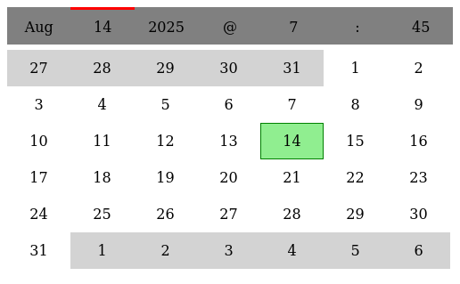

# noice-datepicker

Fewer clicks, swipes, and scrolls. No typing. Here's my attempt at a date/time picker that tries to stay out of your way.

[Click here for a demo](https://alanszlosek.com/files/noice-datepicker.html). Select the tabs (month, day, year, hour, minute) at the top to change those values.

Sometimes (often?) user interfaces don't need to mimic things from the real world. A date/time picker doesn't need to mimic a calendar or a clock.

Note: Soon I plan to add integration points so you can drop into your existing project. If you have suggestions or PRs, I'd be happy to consider them.

## Features

* No swiping, scrolling or typing required to select a date and time
* No third-party dependencies (libraries or frameworks). Not based on React, etc.

## Regarding the name

I don't regularly exclaim "Noice!" ... it's just not my style. But since I am squarely in favor of the ethical and just treatment of my fellow human beings, you can consider the name to be exclaiming "No ICE!" instead.

Thank you for taking part in the fight for ethics, kindness, and justice (if you have the means to do so). The moral arc of the universe depends on it.

## Todo

* Make "@" and ":" not clickable
* Make it easier to integrate. Perhaps: separate JS, CSS and HTML into separate files
* Ability to place multiple datepickers on a page. Accept DOM container and callback function into the init() call.

That's all for now.
